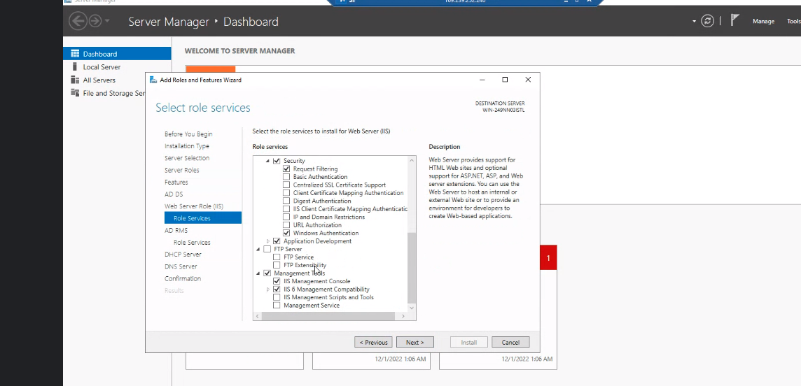
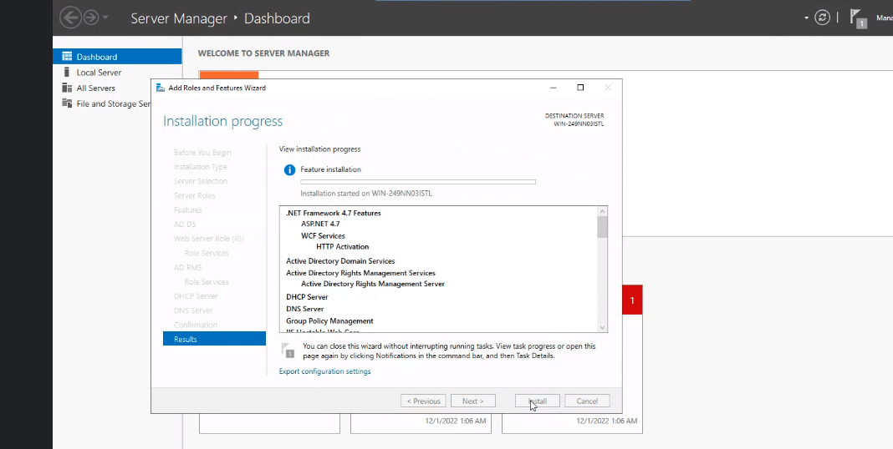

# CLOUD NETWORKING 101

- Access the IIS server and host a simple website on the server

## PROCEDURES FOR CONFIGURATION

### Install IIS(For Windows Users)
- From the Windows start menu, open Server Manager.
- Click Add roles and features.
- Select Role-based or feature-based installation, and choose your server.

 

- Scroll through Server Roles and click Web Server (IIS).
- Add any additional IIS features you wish to install.
- Click Install to start the installation process.

### Create the web application
- Using Windows Explorer, create a new folder in the default IIS web server directory to store your domain's web files. For example, you could create a folder named ` C:\kamilimu\example.com `

